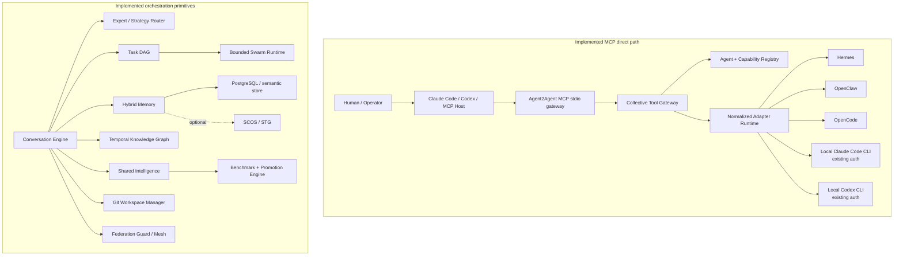

# Agent2Agent

Agent2Agent is a federated collective-intelligence runtime for heterogeneous AI agents. It normalizes agent communication, task delegation, bounded swarms, isolated coding workspaces, memory, knowledge, evaluation and federation behind stable contracts.

This repository is under active implementation. The first vertical slices are intentionally local-first and testable without requiring Agent2Agent to own model-provider API keys.

## Implemented vertical slices

- normalized collaboration/message/agent/task/memory/federation protocol types
- adapter registry with deterministic local adapter
- product integration descriptors for Hermes, OpenClaw and OpenCode
- local CLI discovery for Claude Code, Codex, Hermes, OpenCode and OpenClaw
- stable routable local agent identities with executable, version, auth/readiness and capability metadata
- working local authenticated CLI adapters that reuse each product's existing local configuration instead of collecting provider API keys
- Agent2Agent collective gateway with agent listing, lookup and direct ask routing through registered adapters
- MCP v2 stdio server using the official `@modelcontextprotocol/server` package
- MCP tools: `list_agents`, `find_agent` and `ask_agent`
- non-shell MCP registration helpers for Claude Code and Codex
- bounded nested MCP delegation depth with propagation across local CLI child processes
- task DAG with dependency validation
- bounded swarm runtime with depth/child/runtime/message/cost controls
- scoped authoritative memory with optional cognitive-provider fallback
- temporal knowledge graph
- evidence-gated shared intelligence
- benchmark baseline/candidate comparison with regression blocking
- federation hop, loop and replay guards
- conversation duplicate/round/message/consecutive-turn protection
- expert capability router
- workspace/branch isolation planning and review merge gates
- permission and SSRF policy primitives
- deterministic end-to-end collective demo

## Run locally

Requirements: Node.js 22+ and pnpm 10.33+.

```bash
corepack enable
pnpm install
pnpm typecheck
pnpm lint
pnpm test
pnpm demo
```

Run every currently implemented validation:

```bash
pnpm validate
```

The deterministic demo does not require a model API key.

## Local MCP collective gateway

The MCP stdio server discovers locally installed Agent2Agent-supported CLIs at startup and exposes the registered collective to an MCP-capable host.

Build and run the server directly:

```bash
pnpm mcp:stdio
```

Register Agent2Agent as a user-scoped MCP server in Claude Code:

```bash
pnpm mcp:install -- claude
```

Register it in Codex:

```bash
pnpm mcp:install -- codex
```

Register both:

```bash
pnpm mcp:install -- both
```

With no target argument, the installer defaults to both Claude Code and Codex. Registration is intentionally non-destructive: it does not remove or overwrite an existing `agent2agent` MCP entry. A host conflict is surfaced as an error so existing configuration is not silently replaced.

The installer builds the repository before registering the absolute compiled stdio entrypoint. During source development, rebuild after changing Agent2Agent before starting a host that uses the registered compiled entrypoint.

Once connected, an MCP host can use:

- `list_agents` to inspect currently registered collective members, optionally by capability
- `find_agent` to search by agent ID, name, adapter, URI or capability
- `ask_agent` to route a prompt through a selected registered agent's real adapter

The local MCP runtime does not read Claude Code or Codex credential files. Local CLI adapters continue to rely on the authentication/configuration owned by those CLIs.

Nested Agent2Agent delegation is bounded. Local child agents receive the current depth through `AGENT2AGENT_DELEGATION_DEPTH`, and nested MCP runtimes inherit it. `AGENT2AGENT_MAX_DELEGATION_DEPTH` controls the maximum and defaults to `3`. Invalid or negative depth configuration is rejected rather than silently coerced.

## Architecture



The MCP `ask_agent` path currently routes directly through the collective gateway to the selected registered adapter. The orchestration primitives shown separately above are implemented core services, but are not falsely presented here as being traversed by every MCP call.

PostgreSQL remains the intended authoritative application datastore. SCOS/STG is an optional cognitive memory provider because its current API is alpha and its BUSL-1.1 licensing requires separate commercial terms for for-profit deployment.

## Integration policy

Current upstream integration decisions are recorded under [`docs/integrations/`](docs/integrations/). Product-specific behavior stays behind adapters. A2A and MCP are transport boundaries, not the internal domain model.

### Local Claude Code and Codex, no Agent2Agent API keys

Agent2Agent is designed to reuse the login state owned by the local coding CLIs. Authenticate each CLI once as your normal OS user:

```bash
claude auth login
claude auth status

codex login
codex login status
```

Do not put `ANTHROPIC_API_KEY` or `OPENAI_API_KEY` into Agent2Agent for these adapters. The local Claude/Codex adapter strips those variables before launching the child process and never reads the CLIs' credential files. Claude sessions and Codex threads are resumed using opaque session/thread IDs only.

## Safety model

The runtime treats agents, remote nodes, memory, packages and model output as untrusted. Current core controls include bounded swarms, bounded nested MCP delegation, scoped memory, duplicate-message prevention, federation loop/replay protection, explicit permissions, merge review gates, SSRF target rejection and shell-free MCP host registration. Enforcement is designed to live in runtime policy rather than prompts.

## Status

The full production brief still includes PostgreSQL/pgvector persistence, Redis workers, official A2A transport, remote MCP transport/authentication, broader real vendor adapters, Git worktree execution, merge-conflict reconciliation, package sandboxing, web control center, OpenTelemetry/Prometheus, Docker, Helm and multi-node live federation. Those are subsequent vertical slices and must not be represented as complete until their tests pass.
