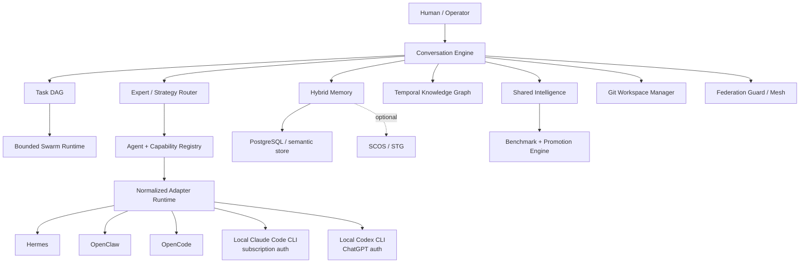

# Agent2Agent

Agent2Agent is a federated collective-intelligence runtime for heterogeneous AI agents. It normalizes agent communication, task delegation, bounded swarms, isolated coding workspaces, memory, knowledge, evaluation and federation behind stable contracts.

This repository is under active implementation. The first vertical slice is intentionally deterministic and model-free so protocol, safety and learning behavior can be tested without paid APIs.

## Implemented vertical slice

- normalized collaboration/message/agent/task/memory/federation protocol types
- adapter registry with deterministic local adapter
- product integration descriptors for Hermes, OpenClaw and OpenCode
- working local authenticated CLI adapters for Claude Code and Codex that reuse existing subscription/ChatGPT login without API keys
- task DAG with dependency validation
- bounded swarm runtime with depth/child/runtime/message/cost controls
- scoped authoritative memory with optional cognitive-provider fallback
- temporal knowledge graph
- evidence-gated shared intelligence
- benchmark baseline/candidate comparison with regression blocking
- federation hop, loop and replay guards
- conversation duplicate/round/message/consecutive-turn protection
- expert capability router
- workspace/branch isolation planning and review merge gates
- permission and SSRF policy primitives
- deterministic end-to-end collective demo

## Run locally

Requirements: Node.js 22+ and pnpm 10.33+.

```bash
corepack enable
pnpm install
pnpm typecheck
pnpm lint
pnpm test
pnpm demo
```

Run every currently implemented validation:

```bash
pnpm validate
```

The deterministic demo does not require a model API key.

## Architecture



PostgreSQL remains the intended authoritative application datastore. SCOS/STG is an optional cognitive memory provider because its current API is alpha and its BUSL-1.1 licensing requires separate commercial terms for for-profit deployment.

## Integration policy

Current upstream integration decisions are recorded under [`docs/integrations/`](docs/integrations/). Product-specific behavior stays behind adapters. A2A and MCP are transport boundaries, not the internal domain model.

### Local Claude Code and Codex, no API keys

Agent2Agent is designed to reuse the login state owned by the local coding CLIs. Authenticate each CLI once as your normal OS user:

```bash
claude auth login
claude auth status

codex login
codex login status
```

Do not put `ANTHROPIC_API_KEY` or `OPENAI_API_KEY` into Agent2Agent for these adapters. The local adapter strips those variables before launching the child process and never reads the CLIs' credential files. Claude sessions and Codex threads are resumed using opaque session/thread IDs only.

## Safety model

The runtime treats agents, remote nodes, memory, packages and model output as untrusted. Current core controls include bounded swarms, scoped memory, duplicate-message prevention, federation loop/replay protection, explicit permissions, merge review gates and SSRF target rejection. Enforcement is designed to live in runtime policy rather than prompts.

## Status

The full production brief includes PostgreSQL/pgvector persistence, Redis workers, official A2A and MCP SDK transports, real vendor SDK adapters, Git worktree execution, merge-conflict reconciliation, package sandboxing, web control center, OpenTelemetry/Prometheus, Docker, Helm and multi-node live federation. Those are subsequent vertical slices and must not be represented as complete until their tests pass.
