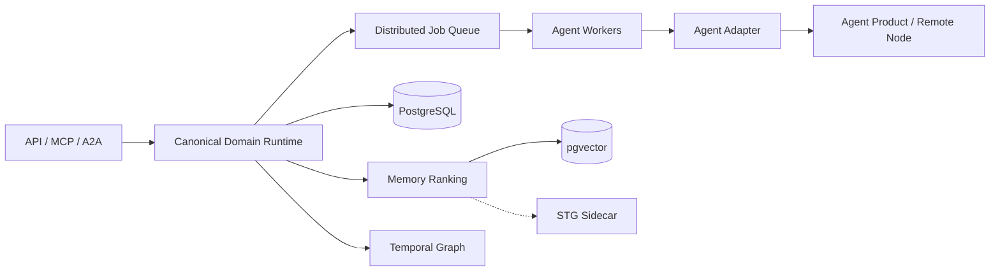

# Architecture

## Core rule

Agent2Agent owns a canonical domain protocol. Vendor SDKs and wire protocols are boundary adapters. This prevents A2A, MCP, a CLI transcript format, or a single model vendor from leaking into task orchestration and durable state.

## Data ownership

| Layer | Responsibility |
| --- | --- |
| PostgreSQL | authoritative transactional state and audit history |
| pgvector | semantic similarity candidates |
| Temporal graph | explicit typed relationships, provenance and validity windows |
| SCOS/STG | optional adaptive associative recall |
| Shared intelligence | governance of reusable claims, patterns, failures and skills |

A canonical ID links records across stores. Cognitive retrieval may fail without making transactional state unavailable.

## Runtime boundaries

## Failure philosophy

- correctness never depends on process-local state in the production persistence slice
- optional integrations degrade independently
- retries require idempotency keys
- cancellation propagates through task, queue, adapter and subprocess boundaries
- branch/worktree ownership prevents concurrent mutation of one working tree
- learning is candidate generation until benchmark and policy gates promote it
